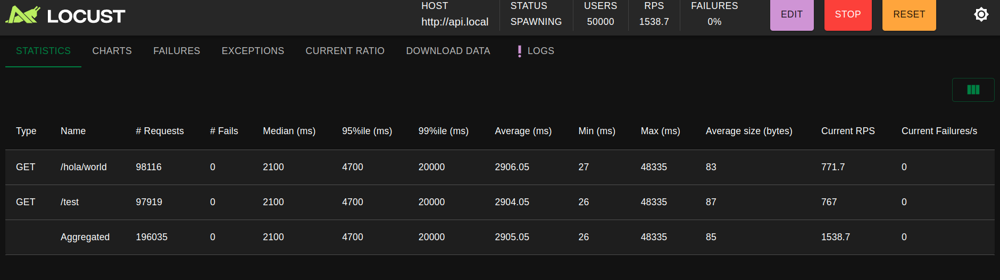

# DevOps Trial: API Deployment & Load Testing



## Description
This project demonstrates a complete DevOps pipeline including:
- REST API deployment using Kubernetes
- Infrastructure provisioning with Terraform
- Kubernetes deployment using Helm Charts
- Load testing with Locust

## Project Components
1. REST API Service
2. Terraform Infrastructure Code
3. Helm Charts
4. Load Testing Scripts

```
project/
├── chart/api/ # REST API helm chart
│ ├── src/
│ ├── Dockerfile
│ └── requirements.txt
│
├── terraform/ # terraform deployment
│ └── main.tf
│
├── load-test/ # Load Testing
│ ├── locustfile.py
│ └── .gitignore
│
└── README.md
```