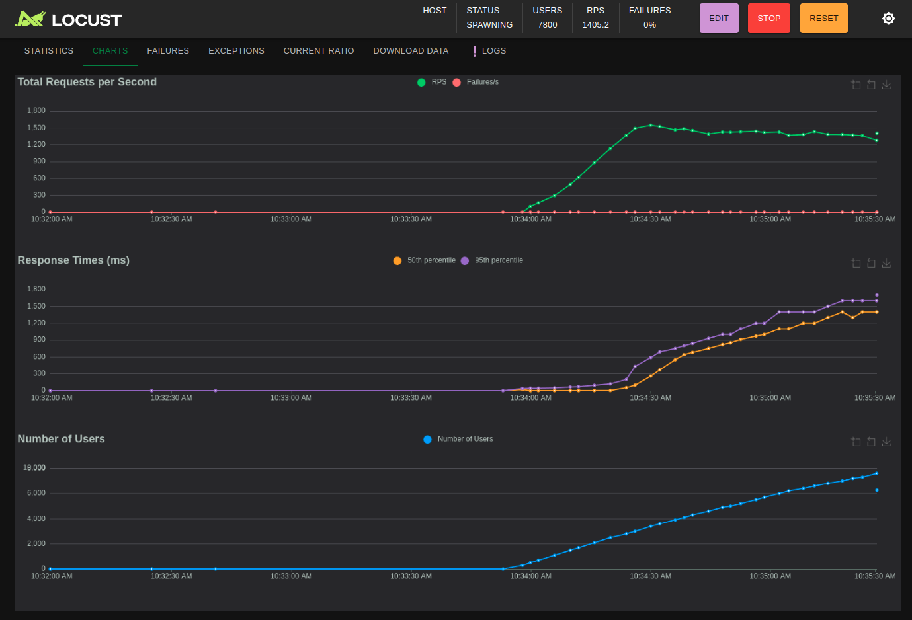
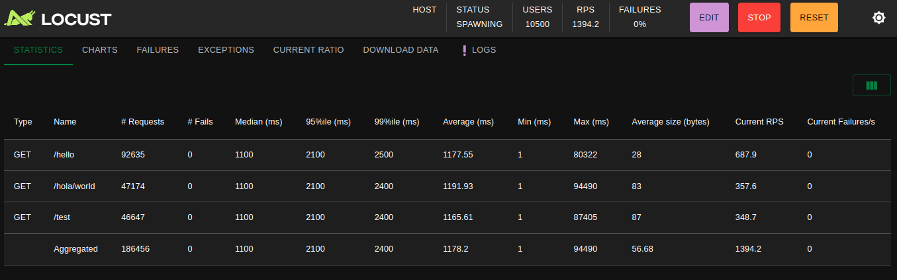

# DevOps Trial: API Deployment & Load Testing




## Description
This project demonstrates a complete DevOps pipeline including:
- REST API deployment using Kubernetes
- Infrastructure provisioning with Terraform
- Kubernetes deployment using Helm Charts
- Load testing with Locust

## Project Components
1. REST API Service
2. Terraform Infrastructure Code
3. Helm Charts
4. Load Testing Scripts

```
project/
├── assets/                     # Images and other assets
│   └── result.png
│
├── chart/                      # Helm charts
│   ├── api/                    # REST API helm chart
│   │   ├── Chart.yaml
│   │   ├── values.yaml
│   │   ├── templates/
│   │   │   ├── deployment.yaml
│   │   │   ├── service.yaml
│   │   │   └── ingress.yaml
│   │   ├── src/
│   │   │   ├── app.py
│   │   │   └── utils/
│   │   ├── Dockerfile
│   │   └── requirements.txt
│   │
│   └── hello-service/           # Hello Service helm chart
│       ├── Chart.yaml
│       ├── values.yaml
│       ├── templates/
│       │   ├── deployment.yaml
│       │   ├── service.yaml
│       │   └── ingress.yaml
│       ├── src/
│       │   └── app.py
│       ├── Dockerfile
│       └── requirements.txt
│
├── terraform/                  # Infrastructure as Code
│   ├── main.tf
│   ├── variables.tf
│   ├── outputs.tf
│   └── providers.tf
│
├── load-test/                  # Load Testing
│   ├── locustfile.py
│   ├── requirements.txt
│   └── .gitignore
│
└── README.md
```